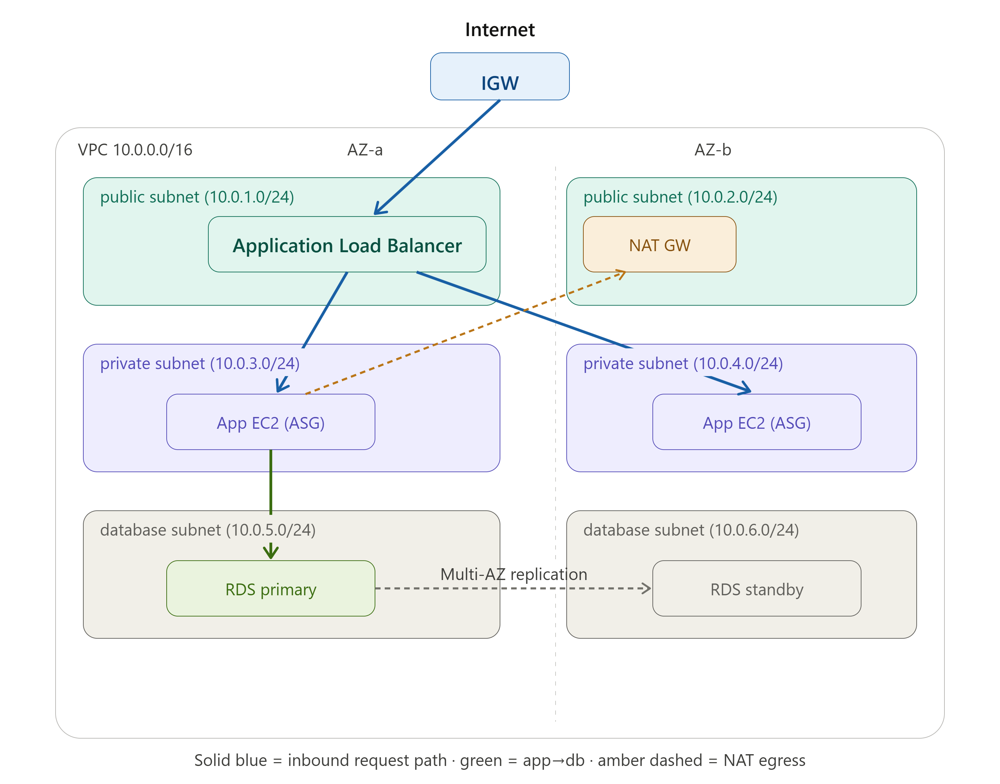

# Three-Tier AWS Architecture with Terraform

*a production ready with ensure high availability, durability and security three tier architecture that contain ALB in public subnet, app tier lives in private subnet and database tier lives in downstream that only accept app tier request.*

---

## Architecture Overview

*this project is a three tier architecture that contains 1 VPC, 2 public subnets which accept public traffic into ALB, ALB split the traffic ingest into auto-scalling group. 4 private subnet include 2 private subnet that app tier with 1 auto-scalling group lives in and 2 private subnet postgreSQL database with multi-az enable lives in.*

### Diagram

---

## Tech Stack

- **IaC:** Terraform (v1.15.x)  
- **Cloud:** AWS (region: ap-southeast-1)  
- **Compute:** EC2 (Auto Scaling Group, Launch Template), Application Load Balancer  
- **Database:** RDS PostgreSQL (Multi-AZ)  
- **Networking:** VPC, public/private/database subnets, NAT Gateway, Internet Gateway  
- **Access:** SSM Session Manager (no bastion / no public SSH)  
- **Secrets:** AWS Secrets Manager (RDS-managed master password)  
- **State:** S3 remote backend with native locking (`use_lockfile`)

---

## Module Structure

terraform-aws/

├── main.tf              \# root: calls \+ wires the three modules

├── variables.tf         \# root inputs (defaults live here)

├── outputs.tf           \# surfaces alb\_dns\_name, db\_endpoint, vpc\_id

├── terraform.tf         \# backend (S3) \+ provider

└── modules/

    ├── networking/      \# VPC, subnets, route tables, IGW, NAT

    ├── compute/         \# ALB, ASG, launch template, SGs, SSM

    └── database/        \# RDS, DB subnet group, DB SG

### `networking`

*\[Owns: ... | Inputs: environment, vpc\_cidr | Outputs: vpc\_id \+ 3 subnet-id lists\]*  
*contain 1 VPC, 6 subnets resources block, 3 route table(6 route table association) and 1 nat gateway and 1 internet gateway.*

*Description: the 6 subnets are broken into 3 parts, 2 public subnets, 2 private subnets for app and 2 private subnets for database, app private subnets consume traffic from public subnets that ALB lives in, A database only processes requests from app private subnets. The networking module outputs 3 subnets id lists and 1 vpc id. Consume environment and vpc CIDR range from root main.tf . root argument data A heavy output and low input module.*

`compute`  
*\[Owns: ... | Inputs: ... | Outputs: app\_sg\_id, alb\_dns\_name\]*  
*contain 1 ami lookup, 2 security groups, 1 ssm manager iam role, 1 launch template, 1 auto scaling group, 1 ALB and ALB listener.*

*description: the 1 security groups config in public subnet that allow all traffic from internet and feed into ALB, the another security group config in private subnet group that only allow traffic from ALB. SSM manager use SSM API that allow developer get into the instance for diagnosis purpose without another bastion host, SSH or any added open port, and the launch template fetch the ami lookup data for creation of launch template. input the vpc id and both private and public subnet id from networking module, the compute module output the app security group id for database module reference and alb dns name for networking module reference. An input and output heavy module.*

### `database`

*\[Owns: ... | Inputs: ... | Outputs: db\_endpoint\]*  
contain 1 PostgreSQL database lives in private subnet group with Multi-AZ enable, 1 security group, 1 database subnet group

description: the security group only allow the request come from the app tier, and the database subnet group that groups PostgreSQL in database tier private subnets with multi-az enable. input database subnet id and vpc id from networking module, app security group from compute module, database username from the root [main.tf](http://main.tf) argument. output db\_endpoint. A heavy input low output module.

---

## Key Design Decisions

- **Bootstrap-isolated state:** *\[Why is the state bucket in a separate `terraform-bootstrap` project with local state? What problem does it prevent?\]*  
  *explanation: if the s3 bucket creation set in the project file, when terraform destroy, its also will destroy the s3 bucket that contain tfstate file which should be long-lived inside s3, if the versioning enable, the bucket will state error that old version file must be clear and delete in order to completely destroy the s3 bucket which shouldn’t be. so set the s3 bucket creation in another directory, terraform bootstrap and link the remote state to the bucket in project directory is a wise move, so when the terraform destroy applied will not affect the tfstate file in s3 bucket.*  
- **Native S3 locking over DynamoDB:** *\[Why `use_lockfile` instead of a lock table?\]*  
  *explanation: when terraform version after 1.10.x, it support use\_lockfile function directly in terraform back-end argument. in previous version, the creation of dynamodb is needed to create a state lock to look the s3 bucket, this is not cost efficient and complicated than s3 lockfile directly.*   
- **Three-tier module split (not per-resource):** *\[Why split by tier? Why NOT a module per resource?\]*  
  *explanation: the advantage of using the module block is to encapsulate the complexity under the tier and good for reuse for next time with similar setup, it make the [main.tf](http://main.tf) file short and simple compare to code from scrap and code everything inside the root file. wrapping a single resource would help little or worsen in reuse in next project and make the root file more complicated and harder to understand.*  
  **SSM Session Manager over a bastion host:** *\[Why no bastion? What does SSM avoid — public IP, open port 22, jump-box management?\]*  
  *explanation: SSM sessions Manager can use SSM API direct control and access the instance without creating another instance just for occasional use, its more architecture efficient and cost optimization, less component, less failure possibility.*   
- **Single NAT Gateway:** *\[Why one NAT and not one-per-AZ? What's the cost vs HA trade-off, and what would production use?\]*  
  *explanation: as the nat gateway actually cost money and not free tier eligible, i select the single nat gateway over one per az nat gateway is due to illustration purpose and cost consideration. In production to ensure highly available is to use one nate gateway per az, or due to cost optimization, production can use a single nat gateway as deployment decision.*  
- **Secrets Manager for DB credentials:** *\[Why `manage_master_user_password` instead of a variable? What does it keep out of state?\]*  
  *explanation: the biggest advantage is it never lands in the Terraform state in plaintext. a hardcoded password sits in the code and state exposes high security issue; even a `sensitive` variable still ends up in state (just hidden from console output). With RDS-managed passwords, the actual secret lives only in Secrets Manager, which is encrypted with KMS and access-controlled by IAM.*   
- **Network segmentation (three route-table postures):** *\[public→IGW, private→NAT, database→isolated. Why this progressive lockdown?\]*  
  *explanation: the public subnet that accept internet traffic through internet gateway, and the ALB split the traffic and ingest into the private subnet which ASG lives in, this setup is to isolate the app instance from public internet and only accept traffic coming from ALB. and the database is the most isolate tier among these three tier, database subnets group only accept request come from the app tier and decline other traffic expect from app tier. this is to protect the data inside database with least privilege applied.*

---

## Prerequisites

- Terraform \>= 1.x  
- AWS CLI configured with credentials  
- An AWS account  
- *\[anything else: Session Manager plugin for SSM access, etc.\]*

\- AWS credentials configured  
 \- with permissions to manage VPC, EC2, ELB, RDS,  
  IAM, SSM, S3, and Secrets Manager. Configure via one of:  
  \- \`aws configure\` (writes \`\~/.aws/credentials\`), or  
  \- environment variables:  
\`\`\`bash  
    export AWS\_ACCESS\_KEY\_ID="..."  
    export AWS\_SECRET\_ACCESS\_KEY="..."  
    export AWS\_DEFAULT\_REGION="ap-southeast-1"  
\`\`\`  
  \- or an AWS SSO / named profile (\`export AWS\_PROFILE="your-profile"\`)

---

## Usage

### 1\. Bootstrap the state backend (run once)

cd terraform-bootstrap

terraform init

terraform apply

*\[One line on what this creates and why it runs first\]*

### 2\. Deploy the application

cd terraform-aws

terraform init

terraform plan

terraform apply

### 3\. Access

\# Get the ALB URL

terraform output alb\_dns\_name

\# Connect to a private instance via SSM (no SSH)

aws ssm start-session \--target \<instance-id\>

### 4\. Teardown

terraform destroy

*\[Note: mention this is safe because state lives in the separate bootstrap bucket\]*

---

## Security Considerations

This architecture applies defense-in-depth and least-privilege across the network, access, and data layers:

**\- Network isolation by tier.**  
 	Public subnets reach the internet via the IGW; private (app) subnets have outbound-only access via NAT; database subnets have no internet route at all. Exposure shrinks with depth — the data tier is unreachable from the internet entirely.  
**\- Security-group chaining, not open CIDRs.**  
 	The app tier only accepts traffic from the ALB's security group, and the database only accepts PostgreSQL (5432) from the app tier's security group. Tiers reference each other by SG, never by open IP ranges, so each tier is reachable only from the one directly in front of it.  
**\- No public database.**   
 RDS is launched with \`publicly\_accessible \= false\` and sits in isolated subnets — it has no public endpoint.  
**\- No SSH, no bastion, no open port 22\.**   
 Administrative access to private instances is via AWS Systems Manager Session Manager (IAM-authenticated, over the SSM service), eliminating inbound SSH and the need for a jump host.  
**\- Encryption at rest**.  
 RDS storage is encrypted (\`storage\_encrypted \= true\`), and Terraform state is encrypted in the S3 backend.  
**\- Managed database credentials.**  
 The RDS master password is generated and stored in AWS Secrets Manager (\`manage\_master\_user\_password\`), so it never appears in Terraform code or state in plaintext.  
**\- State protection**.  
 Remote state lives in a versioned, access-controlled S3 bucket with native locking, isolated in a separate bootstrap project so it can't be destroyed by the application lifecycle.

---

## Cost Note

*This is a portfolio project intended to be deployed for demonstration and then torn down. The main cost-incurring resources are:*

*\- NAT Gateway — hourly charge plus data processing.*  
*\- RDS (Multi-AZ) — runs a standby replica, so it costs roughly double a single-AZ instance; not fully covered by the free tier.*  
*\- Application Load Balancer — hourly charge plus capacity units.*  
*\- EC2 instances — the ASG runs 2 × t3.micro by default.*

*Because state is isolated in the separate bootstrap project, \`terraform destroy\` on the application project tears down all billable resources cleanly without affecting the state backend. The recommended workflow is to apply for a demo, then destroy — redeploying takes a single \`terraform apply\`.*

---

## What I Learned / Challenges

***Challenge: Terraform destroyed its own state backend***

*Early on, the S3 bucket and DynamoDB lock table that held the project's*  
*remote state were defined \*inside the same project\* that used them as a*  
*backend. Running \`terraform destroy\` deleted the state bucket while the*  
*operation was still in progress — corrupting state and orphaning resources.*

***Root cause:** a project must never manage, as a resource, the same bucket*  
*it stores its own state in — destroy will delete the backend out from under*  
*itself.*

***Fix:** I split the backend infrastructure into a separate \`terraform-bootstrap\`*  
*project with \*local\* state, applied once and never destroyed. The application*  
*project now only \*references\* that bucket via its \`backend\` block. This broke*  
*the circular dependency permanently.*

***Challenge: Deciding module boundaries***

*Modularizing wasn't just moving code — the harder question was “where” to draw*  
*the boundaries. I learned that a module earns its place through reuse or by*  
*encapsulating real complexity behind a simple interface, and that wrapping*  
*single resources in modules is an anti-pattern that adds indirection without*  
*benefit. I split by architectural tier (networking / compute / database) so each*  
*module hides genuine complexity and exposes a clean output→input contract,*  
*rather than over-modularizing into a module per resource.*

---

## Future Improvements

- HTTPS via ACM certificate \+ HTTP→HTTPS redirect  
- CI/CD pipeline (GitHub Actions) for plan/apply  
- *\[NAT-per-AZ for HA, VPC endpoints for SSM, remote module registry, etc.\]*

---

